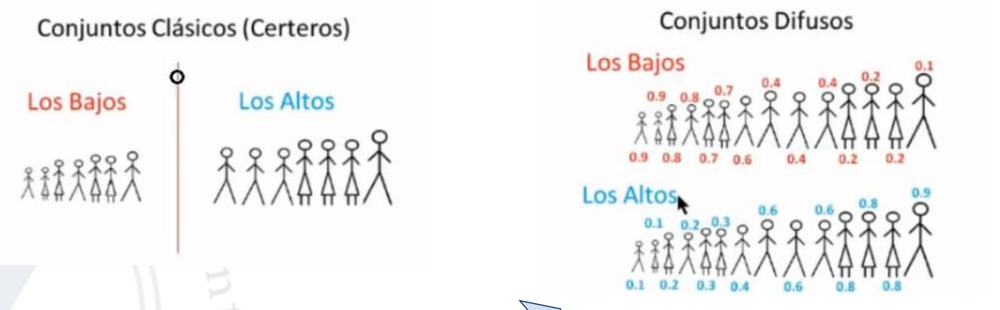
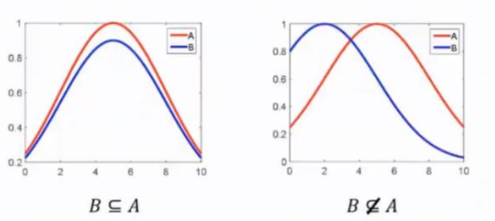
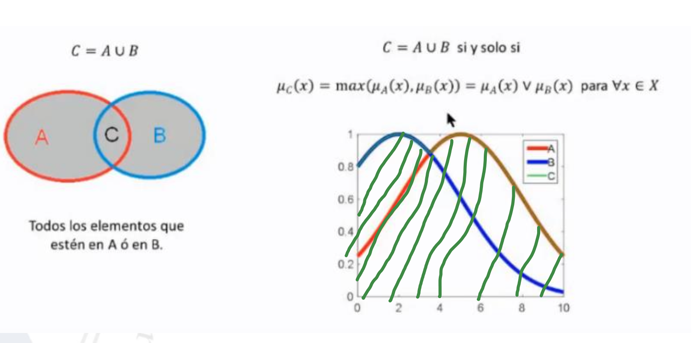

# LOGICA DIFUSA

**Lógica binaria** -> Las proposiciones se pueden reducir a dos estados, verdadero(1) o falso(0) y a los operadores para operar con estas (AND, OR, NOT) 
**Lógica difusa** -> Ya no son solo 2 los estados a los que se puede reducir una proposición, no es blanco o negro, existen gristes

-   En IA se aplica para procesos industriales complejos y sistemas de decision en general. 
    

La lógica difusa analiza métodos y principios de razonaimento sobre conjuntos difusos. 
Un conjunto es una colección de 'cosas', normalmente números

-   **{x}** -> Conjunto de x.
-   **{x | x > 0}** -> Todos los valores del conjunto x que sean mayor que 0. 

\*_Se define como universo de discurso todos los elementos del conjunto_

Existen 2 tipos de conjuntos, clásicos y difusos

-   **Clásicos** -> Un valor solo puede pertenecer a un conjunto
-   **Difusos** -> Un valor puede pertenecer a más de un conjunto en diferente grado 
     

Hay dos maneras de definir conjuntos: **Continuos** y **Discretos**

Propiedades de conjuntos clásicos:

-   **Pertenencia** -> Si todos los elementos de los dos conjuntos coinciden
    -   **B == A** -> Todos los elementos de B están en A
    -   **B != A** -> Hay elementos de B que no están en A
        
-   **Intersección** -> Elementos que coinciden tanto en A como en B
    
-   **Unión** -> Todos los elementos tanto de A como de B
    
-   **Complemento** -> Todos los elementos que estén en B pero no en A
    
