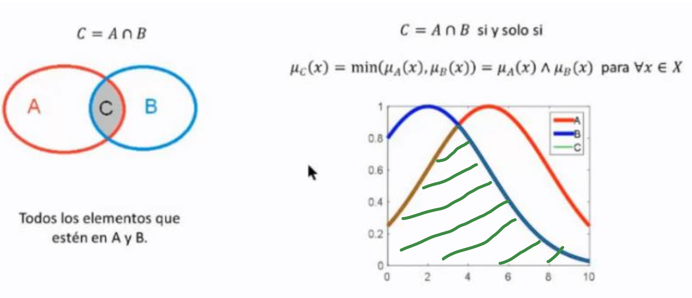
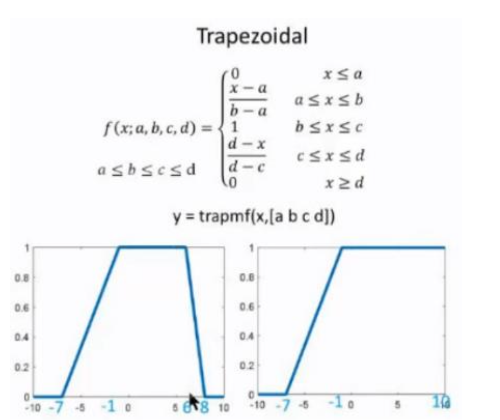

# LOGICA DIFUSA

## Lógica binaria vs Lógica difusa

**Lógica binaria** $\rightarrow$ Las proposiciones se pueden reducir a dos estados, verdadero(1) o falso(0) y a los operadores para operar con estas (AND, OR, NOT). 
**Lógica difusa** $\rightarrow$ Ya no son solo 2 los estados a los que se puede reducir una proposición, no es blanco o negro, existen gristes.

-   En IA se aplica para procesos industriales complejos y sistemas de decision en general. 

## Nociones básicas sobre conjuntos

La lógica difusa analiza métodos y principios de razonaimento sobre conjuntos difusos. 
Un conjunto es una colección de 'cosas', normalmente números.

-   **{x}** $\rightarrow$ Conjunto de x.
-   **{x | x > 0}** $\rightarrow$ Todos los valores del conjunto x que sean mayor que 0. 

\*_Se define como universo de discurso todos los elementos del conjunto_

## Conjuntos clásicos vs difusos

Existen 2 tipos de conjuntos, clásicos y difusos:

-   **Clásicos** $\rightarrow$ Un valor solo puede pertenecer a un conjunto.
-   **Difusos** $\rightarrow$ Un valor puede pertenecer a más de un conjunto en diferente grado. 
     

Hay dos maneras de definir conjuntos: **Continuos** y **Discretos**

## Propiedades de conjuntos clásicos

-   **Pertenencia** $\rightarrow$ Si todos los elementos de los dos conjuntos coinciden - **B == A** $\rightarrow$ Todos los elementos de B están en A - **B != A** $\rightarrow$ Hay elementos de B que no están en A.
    
-   **Intersección** $\rightarrow$ Elementos que coinciden tanto en A como en B.
    
-   **Unión** $\rightarrow$ Todos los elementos tanto de A como de B.
    
-   **Complemento** $\rightarrow$ Todos los elementos que estén en B pero no en A.
    

## Funciones de mebresía

**Función de membresía** $\rightarrow$ Representan el grado de pertenencia de un elemento a un subconjunto definido por una etiqueta.

Carácteristicas de las funciones de membresía:

-   **Soporte** $\rightarrow$ Rango donde la pertenencia(x): x > 0.
-   **Frontera** $\rightarrow$ Rangos donde la pertenencia(x): x > 0 && x < 1.
-   **Ancho de banda** $\rightarrow$ Rango donde la pertenencia(x) x >= 0.5.
-   **Núcleo** $\rightarrow$ Rango donde la pertenencia(x) x == 1.
    

Tipos de funciones de membresía:

-   **Normal vs Subnormal** $\rightarrow$ Las normales tienen núcleo (_rango intermedio donde sube y baja la pertenencia_), y las subnormales no.
-   **Simétricas vs No simétricas** $\rightarrow$ Las simétricas tienen las fronteras iguales, y las no simétricas no.
-   **Convexas vs No convexas** $\rightarrow$ Las convexas tienen forma curva en el centro y las no convexas no.
-   **Abiertas vs Cerradas** $\rightarrow$ La pertenencia sube en una de las fronteras en abiertas (_derecha o izquiera_) y en las cerradas en ninguna de las dos fronteras sube la pertenencia más que la otra.
    
    

### Funciones de membresía distintivas

-   **Singelton** $\rightarrow$ La pertenencia solo es 1 en un caso concreto mientras que en los demás es 0.
      

-   **Trinagular**
    
    _\*Supongamos que estamos modelando la duración de llamadas telefónicas y queremos clasificarlas en tres categorías difusas: "Corta", "Media" y "Larga"_  

-   **Trapezoidal**
    
    _\*Imagina que estás analizando la duración de las interrupciones de energía eléctrica en una región. Puedes utilizar funciones de membresía trapezoidales para representar conjuntos difusos como "Inicio rápido de la interrupción", "Inicio lento y duración corta" y "Inicio lento y duración larga"._  

-   **Gausiana**
    
    _\*En el contexto de un sistema de seguridad, podríamos modelar la duración de la actividad detectada por un sensor de movimiento. La función gaussiana sería útil para representar conjuntos difusos como "Breve actividad", "Actividad moderada" y "Actividad prolongada"._  

-   **Campana generalizada**
    
    _\*Supongamos que estamos modelando el tiempo de espera en una cola, y queremos clasificar la experiencia en términos de "Espera corta", "Espera moderada" y "Espera larga". La función de campana general permitiría ajustar la forma de la campana según la distribución de los tiempos de espera._  

-   **Sigmoidal**
    
    _\*En un sistema de pronóstico de demanda de productos, podríamos modelar la duración de la alta demanda de un producto. Una función sigmoide sería útil para representar conjuntos difusos como "Inicio gradual de la demanda" y "Rápido aumento de la demanda", donde la transición entre ambas es gradual._  

## Relaciones difusas

**Relación difusa** $\rightarrow$ Relación entre valores de dos conjuntos difusos

### Operaciones para relacionar conjuntos difusos

-   **Producto cartesiano** $\rightarrow$ Relaciona 2 conjuntos difusos representados en una matriz
    
    

    _\*En este caso difuso podemos ver como se relacionan 2 conjuntos difusos que analizan el caso difuso de la gravedad de un accidente de coche dependiendo de la velocidad a la que vaya el coche, podemos ver la pertenencia de cada caso en la matriz, ejemplo: para una velocidad de 80km/h hay un grado de pertenencia de 0.5 a tener un accidente de gravedad 3_
    

    
    *\*Gráficas del producto cartesiano entre un conjunto difuos de los libros venidos en una libreria, y el stock de estos en la librería*
      

-   **Composición** $\rightarrow$ Relaciona 3 conjuntos difusos(_A, B, C_) como producto del porducto cartesiano entre estos (_AxB, BxC_).

## Razonamiento aproximado

**Razonamiento aproximado** $\rightarrow$ Modo de pensamiento que permite afrontar problemas mátematicos de lógica difusa mediante el lenguaje gracias a variables linüisticas.

**Variable lingüistica** $\rightarrow$ (x, X, T, M)

-   **x** $\rightarrow$ Nombre de la varibale
-   **X** $\rightarrow$ Universo de discurso
-   **T** $\rightarrow$ Valores lingüisticos que acepta
-   **M** $\rightarrow$ Función para asociar cada T con su significado
    

### Reglas difusas - SI-ENTONCES

En los sistemas difusos se relacionan unas variabes con otras:

-   **Si** x es A **entonces** y es B
    

-   Evaluar una regla difusa con variables lingüisticas según la representación de las funciones de membresía:
    

### Modus ponens difuso

El modus ponens difuos es una regla de inferencia de los conjuntos difusos que afirma que si una condicion (x es A) es verdadera entonces la segunda condición (y es B) también es verdadera.

Para representar esto mediante variables lingüisticas y gráficas de funciones de membresía sería:

